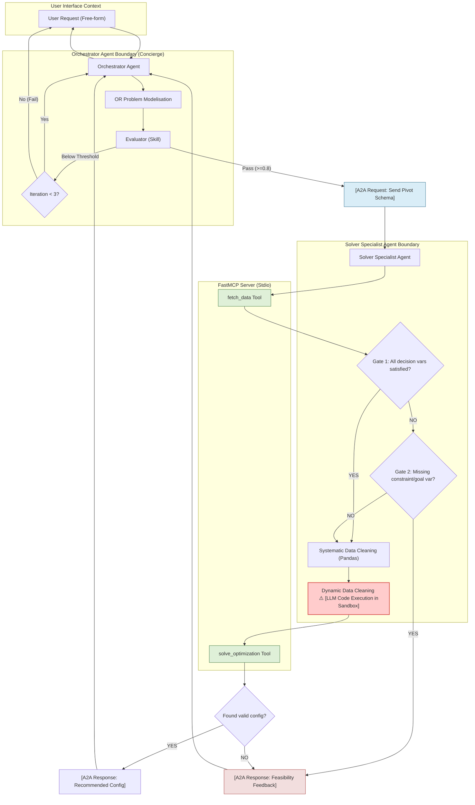

# 5dgai - Optimisation Agent: Technical Architecture Specification

This document defines the complete technical architecture for the **5dgai - Optimisation Agent**.

---

### 1. System Overview

The diagram below defines the complete system architecture, boundaries, and data flow of the Optimization Agent. It reconciles the conceptual Orchestrator-Evaluator loop with the Agent-to-Agent (A2A) boundary, the MCP/Stdio boundary, and the isolated execution point for dynamic cleaning.



---

### 2. Pivot Schema (Core Contract)

This Pydantic model serves as the core schema defined by the Orchestrator, validated by the Evaluator, and executed by the Solver Specialist.

```python
from typing import List, Dict, Any, Union, Literal
from pydantic import BaseModel, Field, field_validator

class AttributeRequirement(BaseModel):
    name: str = Field(
        ...,
        description="Name of the attribute column in the dataset (e.g., 'price', 'tdp')"
    )
    data_type: Literal["float", "int", "str", "bool"] = Field(
        ...,
        description="Expected primitive type for model constraints and optimization math"
    )

class DecisionVariable(BaseModel):
    category: str = Field(
        ...,
        description="Component category mapping directly to a dataset identifier (e.g., 'cpu', 'video-card')"
    )
    required_attributes: List[AttributeRequirement] = Field(
        ...,
        description="The columns that must be extracted from the dataset for this component category"
    )

class DerivedVariable(BaseModel):
    name: str = Field(
        ...,
        description="Name of the computed variable (e.g., 'total_price', 'total_power_draw')"
    )
    formula_expression: str = Field(
        ...,
        description="Mathematical formula syntax using component attributes (e.g., 'sum(cpu.price, video-card.price)')"
    )
    dependencies: List[str] = Field(
        ...,
        description="Component categories or other derived variables involved in the formula"
    )

class OptimizationObjective(BaseModel):
    target_variable: str = Field(
        ...,
        description="The variable to optimize (must be a decision variable attribute or derived variable)"
    )
    maximize: bool = Field(
        default=True,
        description="True to maximize, False to minimize"
    )
    weight: float = Field(
        default=1.0,
        description="The relative importance of this objective for TOPSIS ranking (must be > 0)"
    )

    @field_validator("weight")
    @classmethod
    def check_weight_positive(cls, v: float) -> float:
        if v <= 0.0:
            raise ValueError("Weight must be strictly positive (> 0.0)")
        return v

class Constraint(BaseModel):
    name: str = Field(
        ...,
        description="Unique slug identifying the constraint rules (e.g., 'gpu_tdp_cap')"
    )
    left_side: str = Field(
        ...,
        description="The variable expression evaluated on the left (e.g., 'total_power_draw')"
    )
    operator: Literal["<", "<=", "==", ">=", ">", "!="] = Field(
        ...,
        description="Relational operator matching CP-SAT supported comparisons"
    )
    right_side: Union[float, int, str, bool] = Field(
        ...,
        description="Threshold value or reference variable (e.g., 750 or 'psu.wattage')"
    )
    is_hard: bool = Field(
        default=True,
        description="True if CP-SAT must enforce this strictly; False if treated as a soft penalty target"
    )

class PivotSchema(BaseModel):
    decision_variables: List[DecisionVariable] = Field(
        ...,
        description="List of component categories and features to select"
    )
    derived_variables: List[DerivedVariable] = Field(
        default_factory=list,
        description="List of calculated variables representing aggregates or metrics"
    )
    objectives: List[OptimizationObjective] = Field(
        ...,
        description="List of target criteria to optimize. Single-objective maps directly; multi-objective runs TOPSIS"
    )
    constraints: List[Constraint] = Field(
        ...,
        description="Compatibility limits, budgeting bounds, and power consumption constraints"
    )
```

---

### 3. Agent Topology & A2A Contract

#### Reconciled Node Designations
*   **Orchestrator Agent (Concierge)**: **ADK Agent**. Handles user interaction, refines specifications, structures the Pivot Schema, and runs the Evaluator loop.
*   **Evaluator**: **Agent Skill** executed locally within the Orchestrator Agent's runtime. It evaluates structured outputs without the execution cost of a separate agent.
*   **Solver Specialist Agent**: **ADK Agent**. An isolated agent that manages data acquisition, triggers systematic cleaning, requests sandboxed dynamic cleaning, and communicates with the FastMCP Server.
*   **Data Gateways & cleaning modules**: **Deterministic Skills** owned by the Solver Specialist Agent.
*   **FastMCP Server**: **Deterministic Tool Provider**. Exposes database lookups, Pandas filtering, and OR-Tools CP-SAT math solvers.

#### A2A Request Schema (`SolverRequest`)
```json
{
  "transaction_id": "string (uuid)",
  "pivot_schema": {
    "decision_variables": [],
    "derived_variables": [],
    "objectives": [],
    "constraints": []
  },
  "raw_user_context": {
    "original_prompt": "string",
    "budget_limit": "float"
  }
}
```

#### A2A Response Schema (`SolverResponse`)
```json
{
  "transaction_id": "string (uuid)",
  "status": "SUCCESS" | "INFEASIBLE" | "MISSING_DATA",
  "data": {
    "selections": {
      "cpu": { "id": "str", "name": "str", "price": 299.9, "socket": "AM5" },
      "video-card": { "id": "str", "name": "str", "price": 549.9 }
    },
    "metrics": {
      "total_price": 849.8,
      "topsis_score": 1.0
    }
  },
  "error_details": {
    "reason": "string",
    "failed_constraints": ["string"],
    "missing_attributes": ["string"]
  }
}
```

---

### 4. MCP Boundary

The cut line is established at the computational boundary: all stateful database queries, large Pandas tabular calculations, and OR-Tools CP-SAT compilation execution live on the **FastMCP Server**. This separates LLM execution context from execution-heavy and deterministic operations.

#### FastMCP Tool 1: `fetch_data`
*   **Signature**: `fetch_data(categories: List[str]) -> Dict[str, List[Dict[str, Any]]]`
*   **Return Schema**:
    ```json
    {
      "cpu": [{"name": "AMD Ryzen 5", "price": 199.9, "socket": "AM5"}],
      "video-card": [{"name": "RTX 4070", "price": 599.9, "vram": "12GB"}]
    }
    ```

#### FastMCP Tool 2: `solve_optimization`
*   **Signature**: `solve_optimization(pivot_schema: Dict[str, Any], datasets: Dict[str, List[Dict[str, Any]]]) -> Dict[str, Any]`
*   **Return Schema**:
    ```json
    {
      "status": "OPTIMAL" | "FEASIBLE" | "INFEASIBLE",
      "recommended_configuration": {
        "selected_components": {
          "cpu": {"name": "AMD Ryzen 5", "price": 199.9},
          "video-card": {"name": "RTX 4070", "price": 599.9}
        },
        "calculated_derived_variables": {
          "total_price": 799.8
        }
      },
      "alternative_configs_count": 0
    }
    ```

---

### 5. Evaluator-Optimizer Loop

#### Scoring Rubric
1.  **Completeness (0.0 - 1.0)**: Checks if all standard component categories (CPU, GPU, Motherboard, Power Supply, RAM, Cooler, Storage, Case) needed for a functioning computer are accounted for.
2.  **Coherence (0.0 - 1.0)**: Checks for mathematical contradictions in the schema (e.g. `total_price <= 500` combined with a constraint forcing a minimum GPU price of `600`).
3.  **Intent Fidelity (0.0 - 1.0)**: Ensures user-provided constraints from the free-form text (e.g., "silent", "under 100W TDP") have matching objectives or constraints mapped in the schema.

#### Thresholds & Guards
*   **Pass Threshold**: Scores in all three categories must be $\ge 0.80$.
*   **Iteration Loop Guard**: Maximum of `3` iterations. If threshold validation fails on the 3rd attempt, the Orchestrator exits the loop and asks the user directly for clarification.

#### Structured Feedback Schema
```json
{
  "passed": false,
  "scores": {
    "completeness": 0.67,
    "coherence": 1.00,
    "intent_fidelity": 0.50
  },
  "feedback_details": {
    "missing_categories": ["power-supply", "case"],
    "coherence_violations": [],
    "fidelity_violations": ["User requested a quiet build, but no noise or decibel constraint is defined."]
  }
}
```

---

### 6. Data Layer

#### CSV Metadata Schema
A JSON schema configuration describes the local datasets to direct the RAG and retrieval skills:
```json
{
  "dataset_metadata": {
    "file_name": "cpu.csv",
    "category_key": "cpu",
    "record_count": 1420,
    "columns": {
      "name": { "type": "str", "required": true },
      "price": { "type": "float", "required": true },
      "socket": { "type": "str", "required": true },
      "tdp": { "type": "int", "required": false }
    }
  }
}
```

#### RAG Retrieval Trigger
The RAG system triggers if the `Orchestrator` specifies a category key or an attribute requirement in the `PivotSchema` that does not match the exact naming mapping in the local dataset metadata dictionary.

#### Decision Gate Logic
*   **Decision Gate 1 ("Are all decision variables satisfied by columns in data?")**:
    If the requested columns are present in the corresponding category CSV files, pass to Systematic Data Cleaning. If columns are missing, pass to Gate 2.
*   **Decision Gate 2 ("Is the missing variable defining a constraint or objective?")**:
    If the missing column is referenced in `PivotSchema.constraints` or `PivotSchema.objectives`, return an `A2A Response` of `MISSING_DATA` with details back to the Orchestrator to notify the user. If the missing column is only an optional request, drop the attribute from the schema and proceed to Systematic Data Cleaning.

---

### 7. Solver Strategy

#### CP-SAT Build Construction
*   **Variables**: For each category $c$, define a set of binary variables $x_{c, i} \in \{0, 1\}$ representing the selection of component index $i$.
*   **Uniqueness**: Enforce $\sum_{i} x_{c, i} = 1$ for all categories $c$.
*   **Compatibility Constraints**: Handled by boolean implication logic or element constraints. For example, if CPU $i$ has socket $S_{cpu, i}$ and Motherboard $j$ has socket $S_{mobo, j}$:
    $$x_{cpu, i} + x_{mobo, j} \le 1 \quad \forall (i, j) \text{ where } S_{cpu, i} \ne S_{mobo, j}$$
*   **Budget Constraint**: Enforce $\sum_{c, i} \text{price}_{c, i} \cdot x_{c, i} \le \text{budget}$.

#### Routing & Multi-Objective Ranking
*   **Single Objective**: Solved directly inside CP-SAT using `model.Minimize(variable)` or `model.Maximize(variable)`.
*   **Multi-Objective**:
    1. CP-SAT is configured to generate $K$ (default: 50) distinct Pareto-optimal configurations using search branching and random search seeds.
    2. These $K$ candidate solutions are exported to a Pandas DataFrame.
    3. The PyMCDM library applies **TOPSIS** to evaluate and rank these $K$ options using the normalized weights defined in the `PivotSchema.objectives`.

---

### 8. Security

#### Dynamic Cleaning Execution Isolation
LLM-generated dynamic-cleaning scripts (such as regex column transformations and outlier removals) pose an execution threat.
*   **Isolation Mechanism**: The Solver Specialist runs the generated code in a lightweight Docker container with:
    *   No network access (`--network none`).
    *   A read-only workspace directory.
    *   Limited execution runtime (maximum timeout: 2.0 seconds).
    *   Hardware usage constraints (maximum memory: 128 MB, CPU limit: 0.5 cores).

#### Input Sanitization
*   All numeric variables (e.g. user-provided budgets) are parsed via regex pattern matching (`^\d+(\.\d{1,2})?$`) and validated using Pydantic schemas before being processed.
*   Natural language strings are stripped of punctuation and command symbols to prevent command-injection risks.

#### Prompt Guardrails
*   System instructions reject any user command requesting overrides of hardware thermal properties, safety limits, licensing terms, or command execution paths.

---

### 9. Project Structure

```
gauss/
├── data/
│   └── pc-csv/
│       ├── case.csv
│       ├── cpu.csv
│       ├── video-card.csv
│       └── metadata.json         # CSV Column metadata
├── specs/
│   ├── problem_definition.md
│   ├── workflow.md
│   └── kaggle_capstone_spec.md
├── app/
│   ├── __init__.py
│   ├── agent.py                 # Concierge / Solver Specialist agents
│   ├── mcp_server.py            # FastMCP optimization server
│   ├── schema.py                # Pivot Schema models
│   ├── security.py              # Sandbox python execution module
│   └── utils.py                 # Data routing skills & TOPSIS utilities
├── tests/
│   └── test_solver.py
├── eval/
│   ├── basic-dataset.json       # 20 Capstone evaluation cases
│   └── eval_config.yaml         # Agents CLI configuration
├── pyproject.toml
└── uv.lock
```

---

### 10. Capstone Concept Mapping

| Capstone Requirement | Workflow Module / File | Redesign Reconciliation Details |
| :--- | :--- | :--- |
| **Agent / Multi-agent system (ADK)** | `app/agent.py` | Orchestrator Agent (Concierge) and Solver Specialist Agent interact using standard ADK A2A messaging protocol. |
| **MCP Server** | `app/mcp_server.py` | FastMCP host containing deterministic code (CP-SAT and data indexing tools) called over Stdio. |
| **Security Features** | `app/security.py` | Input sanitization, strict Pydantic parsing, and sandboxed Docker containers for LLM-generated code. |
| **Agent skills (Agents CLI)** | `eval/` | Folder containing `basic-dataset.json` (23 test cases) and `eval_config.yaml` for grading optimization runs. |
| **Deployability** | Vertex AI Runtime | Packaged using `agents-cli deploy` for containerized execution on Google Cloud runtimes. |

---

### 11. Open Questions / Risks

1.  **Risk**: Dynamic code generation for cleaning might introduce runtime execution errors (e.g., Pandas syntax mismatches).
    *   *Recommended Default*: Fall back to a default, robust systematic cleaning step (removing null values and invalid strings) if the sandboxed script execution fails.
2.  **Risk**: A user request with too many hard constraints may return a result showing no possible builds.
    *   *Recommended Default*: Relax constraints one by one (starting with secondary preferences like case color, followed by noise targets) and prompt the user to confirm the adjusted scope.
3.  **Risk**: CP-SAT optimization runtime could exceed typical real-time response targets if the component dataset size is very large.
    *   *Recommended Default*: Pre-filter component lists in Pandas to keep the top 100 items per category before sending constraints to the CP-SAT engine.
