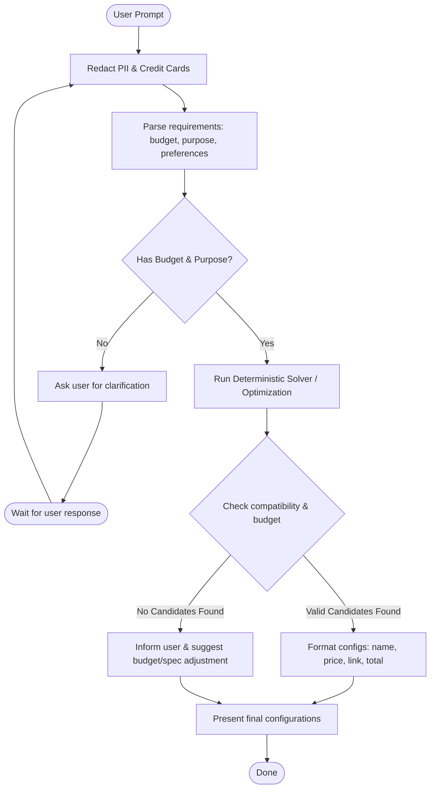

# Technical Design: 5dgai - Optimisation Agent

## 1. System Architecture
The system follows a modular, multi-agent ADK design utilizing a custom **MCP (Model Context Protocol) Server** for deterministic calculations:

```
                     +--------------------+
                     |    User Request    |
                     +---------+----------+
                               |
                               v
                     +---------+----------+
                     |   Concierge Agent  |
                     |    (ADK Agent)     |
                     +---------+----------+
                               |
                               | (A2A Delegation)
                               v
                     +---------+----------+
                     |  Solver Specialist |
                     |   (Sub-Agent)      |
                     +---------+----------+
                               |
                               | (McpToolset Stdio Client)
                               v
                     +---------+----------+
                     |     MCP Server     |
                     |  (app/mcp_server.py) |
                     +---------+----------+
                               |
                               v
                     +---------+----------+
                     |  Component Solver  |
                     |  & JSON Database   |
                     +--------------------+
```

## 2. Workflow Graph
The agent controls the interaction loop and hands off the combinatorial optimization task to the deterministic solver:



## 3. Components Database Schema (Local Prototype)
We will maintain a JSON-based database (`app/data/components.json`) containing component details.

The modular database schema defining all component types and required specification fields is documented in YAML format at:
* **[specs/components_schema.yaml](file:///home/kejia/gauss/specs/components_schema.yaml)**

## 4. Compatibility Rules (Deterministic Checkers)
Compatibility verification rules to be implemented in Python:
- **CPU & Motherboard**: `cpu.specs.socket == motherboard.specs.socket`
- **Power Supply (PSU) Capacity**: `psu.specs.wattage >= total_power_draw_w * 1.2` (including 20% safety margin).
  - `total_power_draw_w` = sum of `power_draw_w` of CPU, GPU, and estimated power draw for other components (e.g. 50W).
- **Case & Motherboard Form Factor**: Case must support motherboard form factor (e.g. an ATX case supports ATX/Micro-ATX motherboards).

## 5. ADK Agent & Tools Definition
The agent will be structured using Vertex AI ADK.

### Concierge Agent (`app/agent.py`)
- **System Prompt**: Acts as the user-facing assistant. It parses requirements, enforces security rules (refusing unsafe/illegal queries), interactively requests missing requirements, and delegates solving to the `SolverSpecialistAgent` via A2A protocol.
- **PII & Credit Card Redaction**: Configured with `before_model_callback` and `after_model_callback` hooks to dynamically scan and redact credit card numbers and Social Security Numbers from all incoming prompts, history context, system instructions, and outgoing model responses before any API calls are executed or displayed.

### Solver Specialist Agent
- **System Prompt**: Acts as the backend specialist for running calculations. It connects to the local MCP server over stdio and registers the MCP tools.
- **Tools**: Loads tool definitions dynamically from the local MCP server process (`app/mcp_server.py`) using `McpToolset`.

### MCP Server (`app/mcp_server.py`)
- Built using the Python `mcp` SDK (FastMCP).
- **Tools**:
  - `find_optimal_builds`: Exposes the deterministic optimization solver tool over Stdio transport.
- **Data**: Interacts directly with the components database JSON.

## 6. Testing & Evaluation

### Unit & Integration Testing
* Tested using `pytest` located in `tests/unit/` and `tests/integration/`.
* Verifies socket compatibility, RAM generations, case form factor constraints, and safety guard refusals.

### Multi-Turn User Simulation
* **Harness**: Implemented in [simulate_dataset.py](file:///home/kejia/gauss/tests/eval/simulate_dataset.py).
* **Dataset**: Evaluates the 20 PC builder test cases from [basic-dataset.json](file:///home/kejia/gauss/tests/eval/datasets/basic-dataset.json).
* **Simulator**: Uses `gemini-2.5-flash` playing the role of a consumer who negotiates upgrades (e.g., SSD, cooler, quiet operations) and budget changes.
* **Orchestration**: Runs programmatic turns through `InMemoryRunner`, preserving session state dynamically.
* **Cleaning**: Strips all non-schema fields (keeping only `author` and `content`) to validate perfectly against the strict Vertex AI `EvaluationDataset` model.
