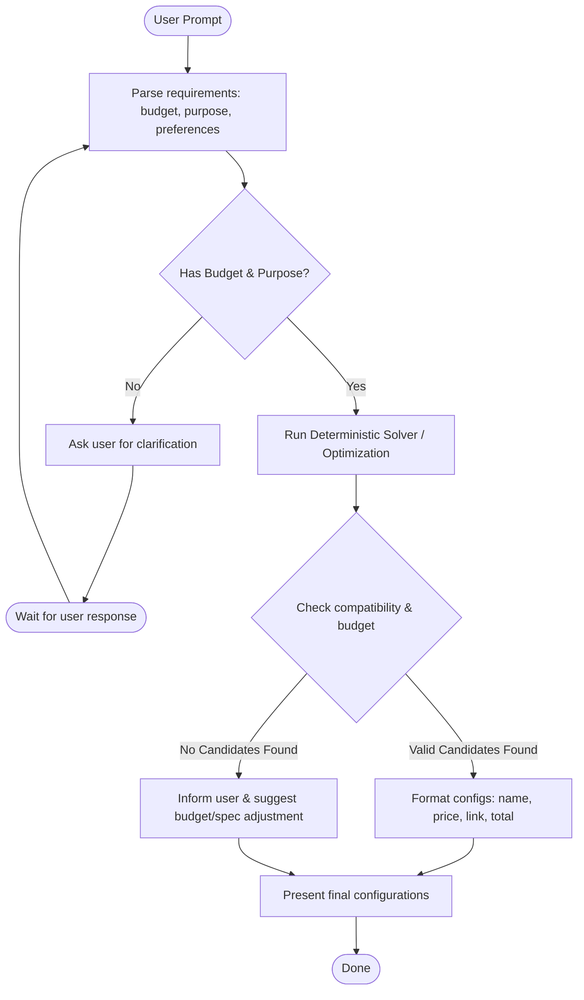

# Technical Design: 5dgai - Optimisation Agent

## 1. System Architecture
The system follows a prototype-first ADK design:

```
                  +--------------------+
                  |    User Request    |
                  +---------+----------+
                            |
                            v
                  +---------+----------+
                  |  Optimization      |
                  |  Orchestrator      |
                  |    (ADK Agent)     |
                  +---------+----------+
                            |
             +--------------+--------------+
             |                             |
             v                             v
   +---------+----------+        +---------+----------+
   |   Component DB     |        | Optimization Solver|
   |      (JSON)        |        |   (Constraint/LP)  |
   +--------------------+        +--------------------+
```

## 2. Workflow Graph
The agent controls the interaction loop and hands off the combinatorial optimization task to the deterministic solver:



## 3. Components Database Schema (Local Prototype)
We will maintain a JSON-based database (`app/data/components.json`) containing component details.

```json
{
  "cpus": [
    {
      "id": "cpu_ryzen7_7700",
      "name": "AMD Ryzen 7 7700",
      "price": 200.00,
      "brand": "AMD",
      "specs": {
        "socket": "AM5",
        "power_draw_w": 65
      },
      "link": "https://example.com/amd-ryzen-7-7700"
    }
  ],
  "gpus": [
    {
      "id": "gpu_rtx3060",
      "name": "GeForce RTX 3060",
      "price": 390.00,
      "brand": "NVIDIA",
      "specs": {
        "vram_gb": 12,
        "power_draw_w": 170
      },
      "link": "https://example.com/rtx-3060"
    }
  ],
  "motherboards": [
    {
      "id": "mb_msi_b850",
      "name": "MSI B850",
      "price": 170.00,
      "brand": "MSI",
      "specs": {
        "socket": "AM5",
        "form_factor": "ATX"
      },
      "link": "https://example.com/msi-b850"
    }
  ],
  "ram": [...],
  "storage": [...],
  "psus": [...],
  "cases": [...]
}
```

## 4. Compatibility Rules (Deterministic Checkers)
Compatibility verification rules to be implemented in Python:
- **CPU & Motherboard**: `cpu.specs.socket == motherboard.specs.socket`
- **Power Supply (PSU) Capacity**: `psu.specs.wattage >= total_power_draw_w * 1.2` (including 20% safety margin).
  - `total_power_draw_w` = sum of `power_draw_w` of CPU, GPU, and estimated power draw for other components (e.g. 50W).
- **Case & Motherboard Form Factor**: Case must support motherboard form factor (e.g. an ATX case supports ATX/Micro-ATX motherboards).

## 5. ADK Agent & Tools Definition
The agent will be structured using Vertex AI ADK.

### Agent Definition (`app/agent.py`)
- **System Prompt**: Defines the persona (Product Assembly Optimization Expert) and explains the process (collect requirements, invoke tools to search components, formulate compatible options, present results).
- **Tools**:
  - `get_components`: Retrieve a list of components matching category or brand.
  - `find_optimal_builds`: A deterministic solver tool that runs a search/optimization algorithm over the components database to generate 1-3 compatible builds maximizing performance/efficiency for a given budget and brand constraints.

### Deterministic Solver Tool (`app/tools.py`)
- This tool implements the mathematical/search optimization logic.
- Instead of the LLM picking individual components one-by-one and guessing compatibility, the LLM calls `find_optimal_builds(budget, preferences, target_use_case)`.
- The tool:
  1. Filters components based on user preferences (e.g., brand, socket type).
  2. Generates all valid combinations of CPU + Motherboard + GPU + RAM + Storage + PSU + Case.
  3. Checks compatibility rules for each combination.
  4. Discards combinations exceeding `budget`.
  5. Ranks valid combinations based on a simple heuristic score (e.g., higher performance CPU/GPU scores, higher RAM capacity, lowest cost) and returns the top 3 configurations.
