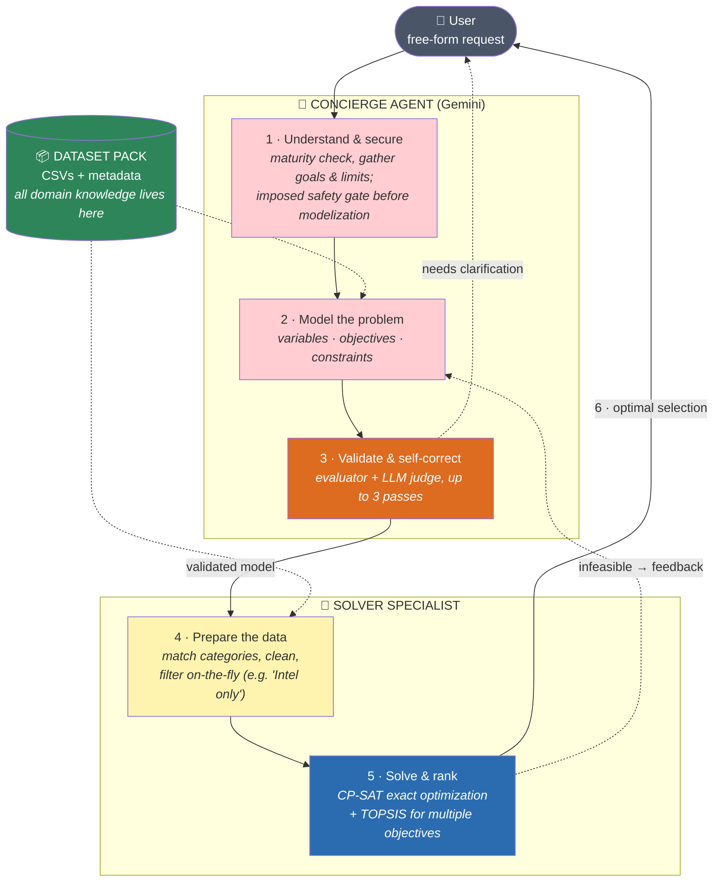

# GAUSS — System Workflow (Presentation Version)

Simplified view of `specs/workflow-final.md` for oral presentation: the agents and the
main steps, nothing else.

**One sentence:** GAUSS turns a free-form request into a formal optimization model,
solves it exactly, and returns the best possible selection — the LLM does the
*understanding*, deterministic code does the *math*.

## The agents

| Agent | Role | Nature |
|---|---|---|
| **Concierge** | Talks to the user, models the problem, validates it | LLM (Gemini, ADK) |
| **Safety Gate** | Screens every request before the loop (imposed workflow node, fail-open on technical failure) | Direct LLM check |
| **LLM Judge** | Checks the model matches the user's *intent* | LLM sub-step |
| **Solver Specialist** | Prepares data and computes the optimum | Deterministic pipeline + one LLM data-filtering step |

## The 6 steps

1. **Understand & secure** — gather goals, limits, preferences until the request is refined enough; the imposed safety gate then screens it before anything runs.
2. **Model** — the request becomes a formal OR model: decision variables, objectives, constraints.
3. **Validate & self-correct** — completeness/coherence checks + intent judge; the loop repairs itself (max 3 passes) before ever bothering the user.
4. **Prepare the data** — categories matched by metadata search; cleaning; qualitative needs ("an Intel CPU") become on-the-fly data filters.
5. **Solve & rank** — CP-SAT finds the exact optimum; TOPSIS ranks when objectives compete.
6. **Deliver** — the optimal selection, with totals and justification. Infeasible? The user gets actionable relaxation suggestions instead.

## Three ideas to remember

- **LLM never executes code** — it only *declares* (models, filters); validated server code executes.
- **Domain-agnostic** — swap the dataset pack, same engine optimizes PCs, meals, anything.
- **Exact math** — the final answer comes from a constraint solver, not from the LLM's imagination.
