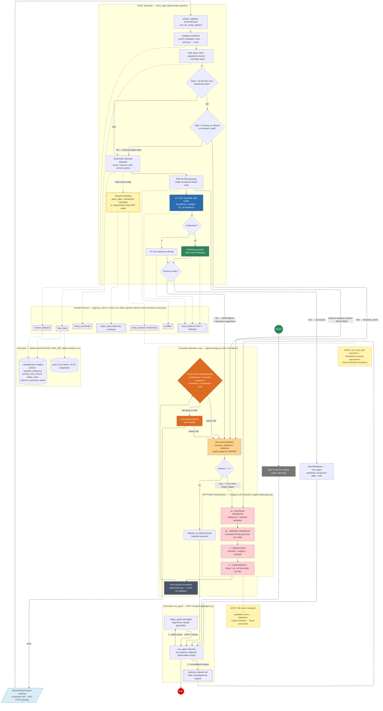

# 5dgai — Optimisation Agent: Final System Workflow

As-built successor of `specs/workflow.md` (the initial modelization). It reflects the real,
verified structure of the system after the root_agent rewiring (commit `28d5ba8`).

Differences vs. the initial workflow:

- **Node G (KB → numeric thresholds) dropped** — owner decision 2026-07-04: qualitative intent
  becomes optimization *objectives*, explicit numbers become literal constraints. No knowledge base.
- **Note n8 superseded** — the LLM never generates/executes code: dynamic cleaning is read-only
  `query_data` + declarative `CleanOp`s validated server-side (zero `exec`/`eval`).
- **Evaluator is hybrid** — deterministic completeness (8 required categories) + coherence first;
  the LLM judge (intent fidelity) only runs when they pass.
- **Entry point is real** — `adk web` → `root_agent` → `optimize_request` tool → the full loop.
- **Domain-agnostic engine (2026-07-05)** — zero domain knowledge in code: the active *dataset
  pack* (`GAUSS_DATA_DIR`, default `data/pc-csv`) supplies the catalog, domain name, safety
  notes, `required_categories` (evaluator completeness) and `primary_cost_column` (implicit
  column, CP-SAT row-cap sort, cleaning rules). Decision-variable categories are resolved to
  catalog keys by metadata search (exact → synonym → fuzzy) before data loading.
- Yellow nodes mark the two remaining gaps: the dynamic-cleaning hook is implemented but not
  invoked by the pipeline, and the Solver is called in-process (A2A HTTP export pending).

## Legend / status

| Marker | Meaning |
|---|---|
| Red stages (C1–E) | LLM structured-output extractions (staged, REPAIR-able individually) |
| Orange (EVAL/JUDGE) | Hybrid evaluator — deterministic gates first, LLM judge gated behind them |
| Blue (CP-SAT) / Green (TOPSIS) | Deterministic optimization core (`app/mcp_server/cpsat.py`, `ranking.py`) |
| ⚠️ Yellow `N7` | Implemented & security-tested (`safe_ops.py`) but `dynamic_clean_hook=None` in the pipeline |
| `REQ` in-process note | Contract (`SolverRequest`/`SolverResponse`) is final; HTTP A2A export still pending (`a2a_app=None`) |
