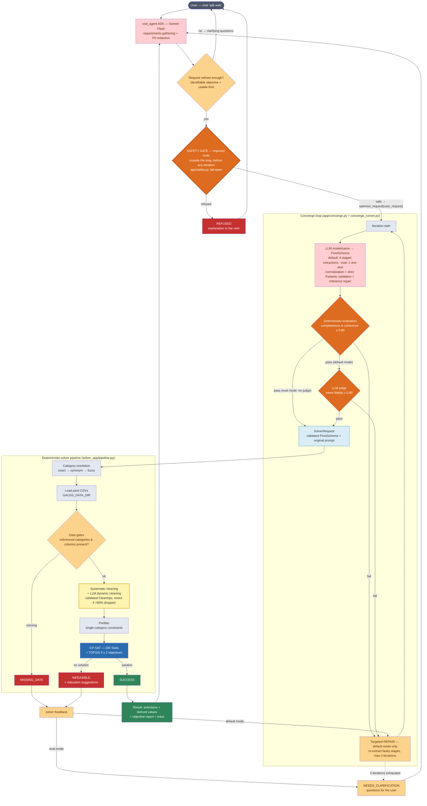

# OptiBuild: Final System Workflow

As-built reference of the business workflow, aligned with the code since the
July 2026 refactor (unified concierge loop, imposed upstream nodes). Successor
of `specs/workflow.md` (initial modelization); quality assessment in
`specs/quality-audit.md`. For the oral-presentation version, see
`specs/workflow-final-simple.md`.

Reference files: `app/agent.py`, `app/safety.py`, `app/concierge.py`,
`app/concierge_runner.py`, `app/modelization.py`, `app/evaluator.py`,
`solver_app/pipeline.py`, `solver_app/gates.py`.

## Global graph

### Color legend

| Color | Meaning |
|---|---|
| Pink | LLM calls (conversation, modelization extractions) |
| Dark orange | Screening/judgment nodes (safety gate, evaluator, judge) |
| Light orange | Decisions & feedback (maturity, data gates, REPAIR, clarification) |
| Yellow (`CLEAN`) | The one place LLM-authored *declarations* touch data — closed CleanOp vocabulary, validated & executed by fixed server code, fail-open |
| Blue | Deterministic optimization core (CP-SAT + TOPSIS) |
| Green | Success path |
| Red | Terminal failures (refusal, missing data, infeasible) |
| Grey | Deterministic plumbing |

## Imposed upstream nodes (outside the concierge loop)

Two mandatory passages precede any iteration — they belong to the workflow,
not to the LLM's discretion:

1. **Maturity check** — carried by the root agent (conversational judgment).
   Criteria: an identifiable objective (something to minimize/maximize) AND at
   least one usable limit or preference. Until satisfied, the root agent asks
   clarifying questions and does NOT call `optimize_request` — no iteration is
   consumed.
2. **Safety gate** — every request reaching the loop first goes through the
   gate (`app/safety.py`: direct structured LLM check, prompt
   `app/prompts/safety_guard.txt` + active pack `safety_notes`, PII-redacted
   input). Imposed by `concierge_runner.run()` for every entry point (ADK chat,
   scripts, eval). **Fail-open**: a technical failure (no API key, network,
   quota, parse error) logs a warning and lets the request proceed; refusal
   happens only on an explicit unsafe verdict. A refusal returns status
   `REFUSED` (`iterations: 0`) — the loop is never entered.

## Modelization detail ("LLM modelization" node)

Both modes produce the same `PivotSchema` and go through the same validation
code (`_validate_items` + `_assemble_schema`); only the number of LLM calls
differs:

- **Default mode** — 4 staged extractions, each fed the previous outputs:
  1. decision variables (categories + required attributes)
  2. derived variables (closed grammar: `sum/min/max/avg/count`)
  3. objectives (`minimize`/`maximize` + weights)
  4. constraints (`left_side op right_side`, hard/soft, provenance)
- **Eval mode** (`GAUSS_FAST_MODELIZATION=1`) — 1 one-shot call producing all
  4 sections at once (`build_schema_oneshot`).

After extraction: LLM-synonym rewriting, item-by-item strict Pydantic
validation (invalid items dropped and logged), then dangling-reference repair
(auto-declaration of forgotten attributes, orphan drops; 0 valid objectives →
clear error → REPAIR).

## Default mode vs eval mode

Both modes run through the SAME `run_concierge` loop — the mode only selects
its parameters (`concierge_runner.run`):

| | Default mode | Eval mode (`GAUSS_FAST_MODELIZATION=1`) |
|---|---|---|
| Safety gate | imposed | **identical** (imposed) |
| Modelization | 4 staged LLM calls (`make_staged_modelizer`) | 1 one-shot LLM call (`make_oneshot_modelizer`) |
| Validation/assembly | `_validate_items` + `_assemble_schema` | **identical** (same code) |
| Evaluation | deterministic **+ LLM judge** (fidelity) | deterministic only (`judge=None`) |
| Repair | up to 3 targeted iterations | none (`max_iterations=1`) |
| Total LLM calls | 5+ per iteration (≤ ~15) + gate | 1 + gate |
| Solver pipeline | same pipeline, same `SolverRequest` | **identical** |

## Exit statuses

| Status | Cause | Reaction |
|---|---|---|
| `SUCCESS` | OPTIMAL/FEASIBLE solution found | Immediate return to the root agent |
| `REFUSED` | Safety gate explicit unsafe verdict | Loop never entered (`iterations: 0`); refusal presented, never retried |
| `MISSING_DATA` | Referenced column/category absent from the CSVs (data gates) | Default: REPAIR stages 3–4 with feedback · Eval: direct clarification |
| `INFEASIBLE` | No combination satisfies the hard constraints | Default: REPAIR stages 3–4 + relaxation suggestions · Eval: direct clarification |

After 3 iterations without success (or the 1st failure in eval mode) →
`NEEDS_CLARIFICATION` with the accumulated questions; `solver_response` is
attached whenever the solver ran.

## Contracts & security boundaries

- **PivotSchema** (`app/schema.py`): the single contract between modelization,
  evaluator, and solver. Everything is strict Pydantic.
- **No LLM code execution**: formulas = closed grammar `sum(a.x, b.y)`; pandas
  query expressions = allowlisted tokens + `engine="numexpr"`; dynamic cleaning
  = closed CleanOp vocabulary with automatic revert of any batch dropping >90%
  of a category.
- **User prompt = data**: transported in delimited `<user_request>` blocks; the
  solver specialist never follows `context.original_prompt`.
- **Swappable dataset pack** (`GAUSS_DATA_DIR`): the engine holds zero domain
  knowledge; `metadata.json` supplies domain, required categories, cost column,
  synonyms, safety notes. Categories are resolved to catalog keys by metadata
  search (exact → synonym → fuzzy) before data loading.

## Under the hood

- **FastMCP server** (`app/mcp_server`, 7 tools over Stdio; the pipeline calls
  the same functions in-process): `search_datasets`, `load_data`,
  `clean_systematic`, `query_data` (read-only, numexpr), `clean_dynamic`
  (closed CleanOp vocabulary), `prefilter`, `solve_build` (CP-SAT + TOPSIS).
  DataFrames never cross the MCP boundary — tools exchange an opaque
  `dataset_handle`.
- **Solver called in-process** through the final `SolverRequest`/`SolverResponse`
  contract; A2A HTTP export pending (`a2a_app=None`).

## Operational modes (env flags)

| Variable | Effect |
|---|---|
| `GAUSS_DATA_DIR` | Selects the active dataset pack (default `data/pc-csv`) |
| `GAUSS_FAST_MODELIZATION=1` | One-shot modelization, no LLM judge, single iteration of the same concierge loop (~5× fewer LLM calls) |
| `GAUSS_DYNAMIC_CLEAN=0` | Disables the dynamic-cleaning planner (default: on, fail-open) |
| `GAUSS_EVAL_ENABLED=1` | Unlocks the admin-only evaluation tooling (`scripts/run_eval.py`) |

## Deployment

Single Cloud Run service (`gauss`, europe-west1, scale-to-zero, IAM-private), Gemini via
Vertex (`GOOGLE_GENAI_USE_VERTEXAI=TRUE`), data pack co-located in the container.
Access for demos: `gcloud run services proxy gauss --region europe-west1 --port 9090`.
