# 5dgai — Optimisation Agent: Final System Workflow

As-built successor of `specs/workflow.md` (the initial modelization). Reflects the real,
verified structure as of **2026-07-05** — deployed on Cloud Run (revision `gauss-00008`),
108 offline tests green. Quality assessment: `specs/quality-audit.md`.

Differences vs. the initial workflow:

- **Node G (KB → numeric thresholds) dropped** — owner decision 2026-07-04: qualitative intent
  becomes optimization *objectives*, explicit numbers become literal constraints. No knowledge base.
- **Note n8 superseded, node n7 WIRED (2026-07-05)** — the LLM never generates/executes code:
  dynamic cleaning is an LLM *planner* that sees only column names + a few sample values and
  submits declarative `CleanOp`s (incl. `filter_contains`, literal-only substring) executed by
  fixed, validated server code. This is how qualitative requirements ("an Intel CPU", "a white
  case") are enforced **at runtime, through a tool, with zero pack-specific code**.
- **Domain-agnostic engine** — zero domain knowledge in code: the active *dataset pack*
  (`GAUSS_DATA_DIR`, default `data/pc-csv`) supplies the catalog, domain name, safety notes,
  `required_categories` and `primary_cost_column`. Categories are resolved to catalog keys by
  metadata search (exact → synonym → fuzzy) before data loading.
- **Self-completing modelization** — the pack's required set is injected into stage 1, and
  evaluator feedback names missing categories explicitly: the agent defines the decision
  variables itself and never asks the user to enumerate components.
- **Catalog-grounded judge** — the intent-fidelity judge sees the available columns and cannot
  demand data that does not exist (best-available proxies are accepted).
- **Cost-bounded LLM surface** — thinking budgets capped per call (512/1024), compact context
  (lean catalog per stage, compact prior-JSON, stripped tool returns), at most one
  `optimize_request` call per user message. ~1-2¢ per happy-path conversation.
- **Remaining gap (1)**: the Solver is called in-process — A2A HTTP export pending
  (`a2a_app=None`); the request/response contract is identical in both modes.

```mermaid
---
config:
  layout: elk
---
flowchart TB
    START(("START")) --> A["Input: free-form request (chat / adk web / Cloud Run)"]

    subgraph ROOT["Concierge root_agent — ADK LlmAgent (app/agent.py)"]
        B["root_agent (Gemini)<br>PII-redaction callbacks<br>max 1 optimize call / user message"]
        SG["safety_guard sub-agent<br>(AgentTool + pack safety_notes)"]
        OPB[["optimize_request tool<br>ONE consolidated NL request string<br>returns lean JSON view (no internal schema)"]]
    end

    A --> B
    B -- "1 - safety check" --> SG
    SG -- "SAFE / refusal" --> B
    B -- "2 - consolidated request" --> OPB

    subgraph LOOP["Concierge Optimizer Loop — app/concierge.py (max 3 iterations; one-shot fast mode available)"]
        subgraph MODEL["OR Problem Modelization — 4 staged LLM extractions, bounded thinking (app/modelization.py)"]
            C1["1a - DECISION VARIABLES<br>catalog vocabulary + pack required set<br>(injected via DomainContext)"] --> C2["1b - DERIVED VARIABLES<br>restricted formula grammar (no code)"]
            C2 --> D["2 - OBJECTIVES<br>direction + weights + rationale"] --> E["3 - CONSTRAINTS<br>literal / var_ref thresholds"]
        end
        NORM["Normalize & repair layer<br>synonym maps, formula rewrite,<br>dangling-ref auto-repair, logged drops"]
        F["Pivot schema (Pydantic)<br>app/schema.py — cross-ref validators"]
        EVAL{"EVALUATOR (deterministic)<br>completeness: pack required_categories<br>coherence: contradiction scan"}
        JUDGE["LLM judge (temp 0, thinking 512)<br>intent fidelity — grounded in<br>available catalog columns"]
        FB["Structured feedback<br>NAMES missing categories / violations<br>target_stages for REPAIR"]
        GUARD{"iteration &lt; 3 ?"}
        ASK["NEEDS_CLARIFICATION<br>targeted questions"]
    end

    OPB --> C1
    E --> NORM --> F --> EVAL
    EVAL -- "det pass (≥ 0.80)" --> JUDGE
    EVAL -- "below 0.80" --> FB
    JUDGE -- "below 0.80" --> FB
    FB --> GUARD
    GUARD -- "yes — re-run only target_stages" --> C1
    GUARD -- no --> ASK --> B

    JUDGE -- "pass" --> REQ[/"SolverRequest (pivot schema)<br>in-process call — A2A HTTP pending"/]

    subgraph SOLVER["Solver Specialist — solver_app/ (deterministic pipeline)"]
        SA["solve(): validates SolverRequest"]
        RES["Category resolution<br>search metadata: exact → synonym → fuzzy ≥0.7<br>schema rewritten, mapping traced"]
        N2["load_data: match categories/columns<br>→ coverage report"]
        G1{"Gate 1: all decision vars<br>satisfied by data?"}
        G2{"Gate 2: missing var defines<br>a constraint / goal?"}
        N5["Systematic cleaning (pandas)<br>cost-column rules, coercion, IQR"]
        N7["DYNAMIC CLEANING (n7 — WIRED)<br>LLM planner sees columns + samples only<br>→ declarative CleanOps (filter_contains...)<br>validated & executed server-side, fail-open"]
        H["PRE-FILTER (pandas)<br>single-component literal rules"]
        I["CP-SAT: assemble valid builds<br>ExactlyOne / budget / var_ref headroom"]
        J{"# objectives ?"}
        K["CP-SAT optimizes directly"]
        M["TOPSIS (pymcdm)<br>rank K=50 candidates"]
        N13{"Found a config ?"}
    end

    REQ --> SA --> RES --> N2 --> G1
    G1 -- YES --> N5
    G1 -- NO --> G2
    G2 -- "NO — strip descriptive attrs" --> N5
    G2 -- "YES → MISSING_DATA" --> FB
    N5 --> N7 --> H
    H -- "required category emptied → INFEASIBLE" --> FB
    H --> I --> J
    J -- "1" --> K --> N13
    J -- "≥2" --> M --> N13
    N13 -- "YES → SUCCESS" --> OUT["SolverResponse → root_agent<br>markdown table + derived values<br>+ objective report"]
    N13 -- "NO → INFEASIBLE<br>+ relaxation suggestions" --> FB
    OUT --> B
    B --> FIN(("END"))

    subgraph MCP["FastMCP Server — app/mcp_server (7 tools over Stdio; pipeline calls the same functions in-process)"]
        T1[["search_datasets"]]
        T2[["load_data"]]
        T3[["clean_systematic"]]
        T4[["query_data (read-only, numexpr)"]]
        T5[["clean_dynamic (5-op CleanOp vocabulary)"]]
        T6[["prefilter"]]
        T7[["solve_build (CP-SAT + TOPSIS)"]]
    end

    subgraph DATA["Data layer — dataset pack (GAUSS_DATA_DIR, default data/pc-csv)"]
        CSV[("pack CSVs (demo: 25 PC categories,<br>memory enriched by pack tooling)")]
        META[("metadata.json catalog<br>domain, required_categories,<br>primary_cost_column, safety_notes,<br>columns, synonyms, quirks")]
    end

    RES -.-> T1
    N2 -.-> T2
    N5 -.-> T3
    N7 -.-> T5
    H -.-> T6
    I -.-> T7
    K -.-> T7
    M -.-> T7
    T1 -.-> META
    T2 -.-> CSV & META

    NOTE1["NOTE: KB node G dropped —<br>qualitative intent → objectives,<br>explicit numbers → literal constraints,<br>keywords → runtime filter_contains"]
    NOTE2["NOTE: zero LLM code execution —<br>allowlisted numexpr expressions,<br>closed CleanOp vocabulary,<br>literal-only substring matching"]
    E -.- NOTE1
    T5 -.- NOTE2

    style C1 fill:#FFCDD2
    style C2 fill:#FFCDD2
    style D fill:#FFCDD2
    style E fill:#FFCDD2
    style A stroke:#757575,fill:#757575,color:#ffffff
    style NORM fill:#e2e8f0
    style F fill:#4a5568,color:#fff
    style EVAL fill:#dd6b20,color:#fff
    style JUDGE fill:#dd6b20,color:#fff
    style FB fill:#fbd38d,color:#5c2e00
    style REQ fill:#d9edf7,stroke:#31708f
    style I fill:#2b6cb0,color:#fff
    style M fill:#2f855a,color:#fff
    style N7 fill:#fff3b0,stroke:#d4a017,stroke-width:2px
    style NOTE1 fill:#fff3b0,stroke:#d4a017,color:#5c4400
    style NOTE2 fill:#fff3b0,stroke:#d4a017,color:#5c4400
    style START fill:#2f855a,stroke:#00C853,color:#ffffff
    style FIN stroke:#D50000,fill:#D50000,color:#ffffff
```

## Legend / status

| Marker | Meaning |
|---|---|
| Red stages (C1–E) | LLM structured-output extractions (staged, REPAIR-able individually, thinking capped 512/1024) |
| Grey `NORM` | Deterministic tolerance layer for LLM output shapes (7 repair mechanisms, all regression-tested) |
| Orange (EVAL/JUDGE) | Hybrid evaluator — deterministic gates first; catalog-grounded LLM judge behind them |
| Yellow `N7` | The one place LLM-authored *declarations* touch data — closed vocabulary, validated & executed by fixed server code, fail-open (`GAUSS_DYNAMIC_CLEAN=0` to disable) |
| Blue (CP-SAT) / Green (TOPSIS) | Deterministic optimization core (`app/mcp_server/cpsat.py`, `ranking.py`) |
| `REQ` in-process note | Contract (`SolverRequest`/`SolverResponse`) is final; HTTP A2A export still pending (`a2a_app=None`) |

## Operational modes (env flags)

| Variable | Effect |
|---|---|
| `GAUSS_DATA_DIR` | Selects the active dataset pack (default `data/pc-csv`) |
| `GAUSS_FAST_MODELIZATION=1` | One-shot extraction + deterministic evaluation (~5× fewer LLM calls) |
| `GAUSS_DYNAMIC_CLEAN=0` | Disables the n7 dynamic-cleaning planner (default: on, fail-open) |
| `GAUSS_EVAL_ENABLED=1` | Unlocks the admin-only evaluation tooling (`scripts/run_eval.py`) |

## Deployment

Single Cloud Run service (`gauss`, europe-west1, scale-to-zero, IAM-private), Gemini via
Vertex (`GOOGLE_GENAI_USE_VERTEXAI=TRUE`), data pack co-located in the container.
Access for demos: `gcloud run services proxy gauss --region europe-west1 --port 9090`.
